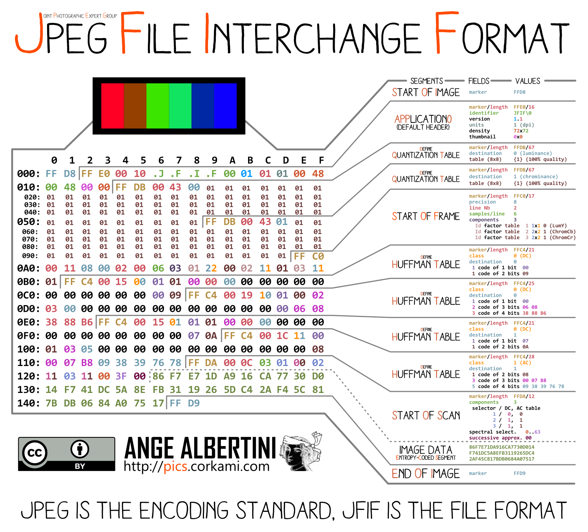
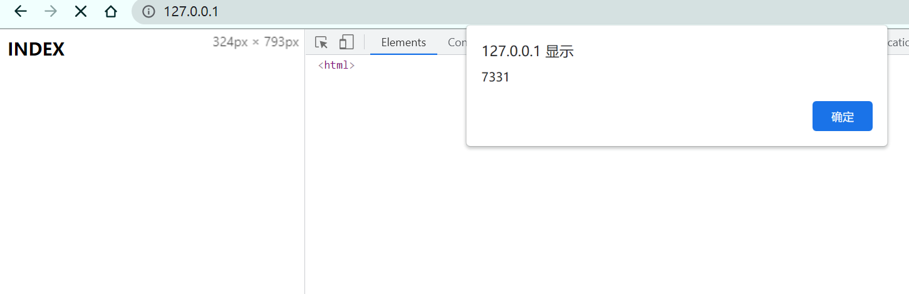

# polyglot-xss-jpeg-generator

Generate polyglot xss jpeg with your customized height and width


## Concept

We can make a polyglot xss jpeg file according to the jpeg standard. 

Generally the file looks like:

```javascript
\xff\xd8\xff\xe0\t:JFIF/*
LOTS OF PADDING
*/=alert(1);/*
LOTS OF PADDING
*///\xff\xd9
```


The concept is to take normal jpeg file as input and  replace the `start of image` segment with our payload.
Then add extra 4 bytes at the end of file.

Because our payload follows the file format above so it can be treated as normal jpeg file.

Note: Because we need to avoid the appearance of `*/` in the original file, `*/` will be replaced so the image seems broken(  Whatever

## Arbitary dimensions 

The height and width of jpeg file dimensions is stored in the `start of frame` segment. Just change the bytes.

## Exploits


* MIME type sniffing

Sometimes, website won't set `X-Content-Type-Options: nosniff`.
So browser will guess the correct MIME type by looking at the bytes of the resource.That allows our payload to be seen as valid javascript resource.

* CSP bypass

`default-src 'self';script-src 'self';` can only be bypassed when you have insite js resource or controllable endpoints like jsonp. You can use polyglot picture file or `.wave` file to bypass limit.

PAYLOAD:
`<script charset="ISO-8859-1" src="YOUR_OUTPUT_JPEG_PATH"></script>`


## Usage

```bash
polyglot_xss.py [--height HEIGHT] [--width WIDTH] input output payload
```

example
```powershell
python polyglot_xss.py C:\Users\JoeZhou\Desktop\shiroyasha.jpeg test\out --height 450 --width 450 alert(7331)
```



## References

https://portswigger.net/research/bypassing-csp-using-polyglot-jpegs

https://github.com/corkami/pics/blob/master/binary/JPG.png